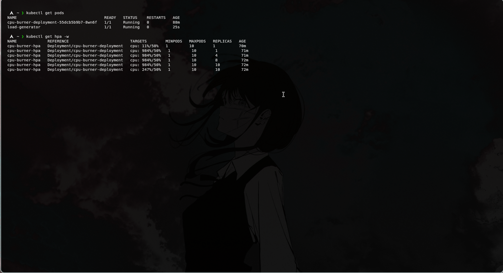

# 🚀 Kubernetes Horizontal Pod Autoscaler (HPA) Sandbox

A hands-on demonstration of Kubernetes automated scaling. This project features a custom-built Node.js application deployed to a local Minikube cluster, complete with a simulated traffic spike to trigger the Horizontal Pod Autoscaler (HPA) in real-time.

## 🏗️ Architecture & Tech Stack
* **Minikube:** Local Kubernetes cluster environment.
* **Docker:** Containerization of the application.
* **Node.js:** A lightweight web server explicitly designed to consume CPU cycles to simulate high server load.
* **Metrics Server:** Kubernetes add-on for cluster-wide resource monitoring.
* **Kubernetes Resources Used:** Deployments, Services (ClusterIP), and HPA.

## 📂 Project Structure
* `app.js` & `Dockerfile` - The Node.js application and its container blueprint.
* `deployment.yaml` - Ensures 1 base replica of the app is always running with strictly defined CPU requests.
* `service.yaml` - Exposes the deployment internally so traffic can reliably reach the pods.
* `hpa.yaml` - The rules engine: Scales the deployment up to 10 pods if average CPU usage exceeds 50%.

---

## 🧠 Core Concepts Demonstrated

### 1. The Deployment & Service (The Foundation)
The application is managed by a Kubernetes **Deployment**, which ensures that at least one pod (container) is always running and healthy. A **Service** acts as the stable front door, routing internal cluster traffic to whichever pods are currently alive, even as they are dynamically created or destroyed by the autoscaler.

### 2. Load Testing (The Trigger)
To prove the architecture works, I deployed a temporary container inside the cluster to act as a traffic generator. This container endlessly spams the application's `/burn` endpoint, forcing the Node.js app to execute heavy mathematical calculations, simulating a massive influx of users.

**Caption:** *The temporary load-generator pod hammering the internal service and forcing the CPU to work.*

### 3. The Horizontal Pod Autoscaler (The Action)
Kubernetes doesn't scale automatically out of the box. I configured an **HPA** to constantly monitor the CPU utilization of the pods via the Metrics Server. The rule is simple: if the average CPU usage across all pods exceeds 50%, spin up more pods (up to a maximum of 10).

As the load generator spiked the CPU past the 50% threshold, the HPA dynamically scaled the deployment from 1 pod up to 10 pods to handle the load.

**Caption:** *The HPA reacting to the massive CPU spike (hitting over 900%) and automatically scaling the replicas from 1 to 10 to stabilize the cluster.*

---

## 💡 Key Takeaways
* How to architect and connect Kubernetes resources (Deployments, Services, HPA) declaratively using YAML.
* The critical relationship between defining CPU `resources.requests` in a deployment and enabling an HPA to calculate the math required for scaling.
* How to test internal cluster networking by deploying temporary pods to simulate microservice-to-microservice communication.
